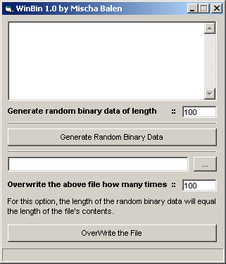



## WinBin \- File Deletion Utility

### Description

Open a file and overwrite its contents with random binary data, up to 1 billion times. The length of the binary number is taken from the number of chars in the file to make sure it really is overwritten. Seems to be quite secure ;)
 
### More Info
 

             |
---                |---
**Submitted On**   |2002-08-26 11:20:16
**By**             |[boltfishy](https://github.com/Planet-Source-Code/PSCIndex/blob/master/ByAuthor/boltfishy.md)
**Level**          |Intermediate
**User Rating**    |5.0 (10 globes from 2 users)
**Compatibility**  |VB 6\.0
**Category**       |[Files/ File Controls/ Input/ Output](https://github.com/Planet-Source-Code/PSCIndex/blob/master/ByCategory/files-file-controls-input-output__1-3.md)
**World**          |[Visual Basic](https://github.com/Planet-Source-Code/PSCIndex/blob/master/ByWorld/visual-basic.md)
**Archive File**   |[WinBin\_\-\_F126617942002\.zip](https://github.com/Planet-Source-Code/boltfishy-winbin-file-deletion-utility__1-38120/archive/master.zip)

